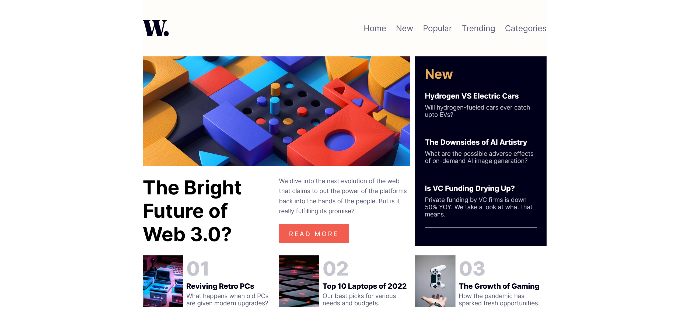
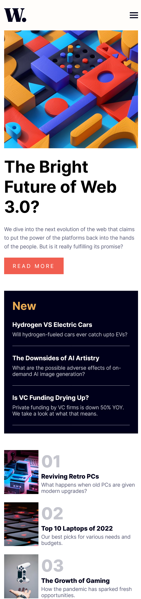

# Frontend Mentor - News homepage solution
Live Site URL: [https://news-home-page-veeru.netlify.app/](https://news-home-page-veeru.netlify.app/)

This is a solution to the [News homepage challenge on Frontend Mentor](https://www.frontendmentor.io/challenges/news-homepage-H6SWTa1MFl). Frontend Mentor challenges help you improve your coding skills by building realistic projects. 

## Table of contents

- [Overview](#overview)
  - [The challenge](#the-challenge)
  - [Screenshot](#screenshot)
  - [Links](#links)
- [Author](#author)

## Overview

### The challenge

Users should be able to:

- View the optimal layout for the interface depending on their device's screen size
- See hover and focus states for all interactive elements on the page

### Screenshot

### Links

- Live Site URL: [https://news-home-page-veeru.netlify.app/](https://news-home-page-veeru.netlify.app/)

### Built with

- Semantic HTML5 markup
- CSS custom properties
- Flexbox
- CSS Grid
- Mobile-first workflow

## Author

- Website - [veeru portfolio](https://veeru-portfolio.netlify.app/)
- Frontend Mentor - [@veeru-neerukonda](https://www.frontendmentor.io/profile/veeru-neerukonda)
- Twitter - [@empyrean__sama](https://www.twitter.com/empyrean__sama)